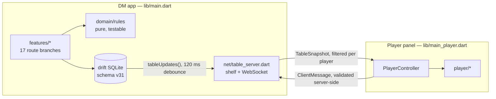

<div align="center">


<br>

**A LAN-synced Dungeon Master toolkit for D&D 2024 — campaign, combat and world management on the DM's screen, with a live player panel in everyone else's browser.**

[](https://flutter.dev)
[](https://dart.dev)
[](#installation)
[](#testing)
[](LICENSE)
[](NOTICE.md)

[English](README.md) · [Türkçe](README.tr.md)

</div>

---

## What it is

DM Table is a **self-hosted** table companion. The DM runs the desktop (or Android) app; it starts an
HTTP + WebSocket server on the local network and serves a full player web panel from its own assets.
Players join by scanning a QR code — no accounts, no cloud, no internet connection required.

Everything the players see is **derived from the DM's database and pushed as snapshots**. The DM is
the single source of truth: players send requests, the server validates them, writes them, and
broadcasts the new table state to everyone.

```
DM app (Windows / Android)                     Players (any browser on the LAN)
┌──────────────────────────────┐               ┌────────────────────────────┐
│  Campaign SQLite (drift)     │               │  Character sheet · dice    │
│  Rules engine · SRD 5.2      │  snapshots →  │  Inventory · quests · map  │
│  Combat · world · calendar   │  ← requests   │  Chat · shops · loot       │
│  HTTP + WebSocket server ────┼───── LAN ─────┤  Served from the DM device │
└──────────────────────────────┘               └────────────────────────────┘
```

## Highlights

| | |
|---|---|
| **Campaigns** | Each campaign is its own SQLite file + media folder. Create, switch, delete, back up and restore — including *restore a backup as a new campaign* without touching the live one. |
| **SRD 5.2 library** | 505 creatures, 407 spells, 1 361 items & magic items, 60 classes/subclasses, backgrounds, species, feats and conditions — bundled offline, searchable, with full stat blocks. |
| **Characters** | Guided creation wizard, character sheet, level-up with subclass previews, homebrew features with usage counters, portraits. Players can build their own characters from the panel. |
| **Combat** | Initiative with player-rolled entries, attack → damage flow, conditions with rules text, death saves, legendary actions & resistances, CR/XP encounter budget, monster portraits. |
| **World** | Force-directed graph of locations *and* NPCs with editable bond types, maps with pins (treasure, shops, sub-maps), reveal-to-players toggles, backlinks. |
| **Travel** | Map scale in miles, multi-stop routes drawn on the map, SRD pace rules, and **ongoing journeys** that survive tab switches, with random-encounter checks per travel segment. |
| **Calendar** | Fully custom calendar (months, weekday names, seasons, eras), chronicle timeline, recurring reminders, and calendar-driven shop restocking. |
| **Codex** | Notion-style nested DM notes: 15 block types, inline rich text, `[[wiki links]]`, slash commands (`/r`, `/monster`, `/spell`, `/page`…), drag & drop, search. |
| **Quests & loot** | Share quests with specific players, individual accept/reject or party vote, reward pools that land in inventories exactly once, party purses, shops with stock and open/closed state. |
| **Random tables** | Editable d-anything tables with validation, a 39-culture offline name generator, starter tables in EN/TR. |
| **AI tools (opt-in)** | Bring your own key (Gemini / OpenAI / Claude) for NPC, quest, encounter and random-table generation. **Keys are stored on the device only and never touch the LAN.** |
| **Music** | Playlists and tracks copied into the campaign folder, included in backups. |
| **Bilingual** | Every visible string — DM app, player panel and server messages — exists in English and Turkish. |

## Screenshots

<!--
  Drop PNGs into docs/screenshots/ and reference them here, e.g.

  | Session | Combat | Player panel |
  |---|---|---|
  |  |  |  |
-->

_Screenshots coming soon._

## Design

Two hand-built themes rather than stock Material: **Parchment** (warm cream, ink red, bronze) for
light mode and **Stone & Ember** (warm black, ember red, gold) for dark mode. Headings use
[Cinzel](https://fonts.google.com/specimen/Cinzel); long-form reading surfaces use
[EB Garamond](https://fonts.google.com/specimen/EB+Garamond), subset to Latin + Turkish (851 KB → 186 KB)
because the player panel is downloaded over the LAN and every megabyte counts. Body UI stays on the
system sans for legibility. Colors, spacing and breakpoints are exposed as theme extensions
(`context.fantasyColors`, `context.spacing`, `Breakpoints`) instead of scattered magic numbers.

## Installation

### Requirements

- [Flutter](https://docs.flutter.dev/get-started/install) 3.44 or newer (Dart 3.12+)
- **Windows:** Visual Studio 2022+ with the *Desktop development with C++* workload, Developer Mode on
- **Android:** Android SDK (via Android Studio) and a JDK

### Build

```bash
git clone https://github.com/<owner>/dm-table.git
cd dm-table
flutter pub get
flutter build windows --release
```

The executable lands in `build/windows/x64/runner/Release/dm_table.exe`. For Android:

```bash
flutter build apk --release
```

### Player panel

The player panel is a separate entry point (`lib/main_player.dart`) compiled to web and **embedded in
the DM app** as an asset bundle (`assets/player_web/`, ~27 MB) that the DM device serves over the LAN.
The prebuilt bundle is committed, so a fresh clone builds as-is. Rebuild it whenever you change the
panel or the wire protocol:

```bash
dart run tools/build_player_web.dart
```

> The tool also rewrites the `player_web` asset block in `pubspec.yaml` (Flutter does not scan asset
> directories recursively) and prunes ~21 MB of unused renderer/plugin payload.

### Running a session

1. Open the app, pick or create a campaign — the SRD library is imported into it on first run.
2. Go to **Session → open the table**; the server starts on port 8080, or the next free port.
3. Players scan the QR code or open `http://<dm-ip>:8080` and claim a character.
4. Windows asks for firewall access on first start — allow **private networks**, or nobody can connect.

## Architecture



**Conventions worth knowing before contributing:**

- **DM authority.** Nothing in a client message is trusted — character identity comes from the
  server's claim map, and rules values are re-read from the database.
- **Per-player filtering.** One base snapshot is built per broadcast and re-scoped per socket
  (quests, party purses, chat whispers). Adding a field to `TableSnapshot.copyWith` without
  forwarding it there is a silent failure mode — there is a regression test for exactly that.
- **Server-side i18n.** The DM doesn't know a player's language, so server messages travel as codes
  (`encodeServerMsg`/`decodeServerMsg`) and are translated in the browser.
- **Migrations.** A new column needs the table definition *and* an `addColumn` migration *and*
  `schemaVersion++`. Ordinary tests build a fresh database and would not catch a missing migration —
  `test/data/migration_test.dart` opens a real legacy schema on purpose.
- **Drift streams.** Raw `customStatement` writes do not notify watchers; use the typed API.

More detail lives in [CONTRIBUTING.md](CONTRIBUTING.md).

## Project layout

```
lib/
  app/          theme, shell, router, design tokens, content gate
  data/         drift database, repositories, campaign registry, media stores
  domain/       pure rules: calendar, travel, encounters, random tables, point buy
  features/     one folder per surface (session, combat, world, codex, ai, …)
  net/          protocol, table server, session service
  player/       the player web panel
  l10n/         app_en.arb · app_tr.arb
assets/
  data/         SRD 5.2 content (gzipped JSON) + starter tables
  player_web/   compiled player panel, served over the LAN
  fonts/ logo/ rules/
tools/          build_player_web.dart · fetch_open5e.dart · build_icon.dart
test/           102 files, 925 tests
```

## Testing

```bash
flutter analyze
flutter test
```

The suite covers the rules engine, repositories, schema migrations, the wire protocol and a set of
widget regressions. CI runs both on every push — see [.github/workflows/ci.yml](.github/workflows/ci.yml).

## Privacy

No telemetry, no accounts, no cloud. The campaign database, media and backups stay on the DM's
machine, and the LAN server only talks to devices on the same network. AI features are opt-in and use
**your own** API key, stored in the device's local preferences — it is never written to the database,
never included in a backup and never sent over the LAN.

## License

Code is licensed under the **GNU General Public License v3.0** — see [LICENSE](LICENSE).

Game content bundled in `assets/data/` comes from the **System Reference Document 5.2**, licensed by
Wizards of the Coast under **CC BY 4.0**; fonts are under the SIL Open Font License. Attribution
details are in [NOTICE.md](NOTICE.md). DM Table is an independent project, not affiliated with or
endorsed by Wizards of the Coast.
