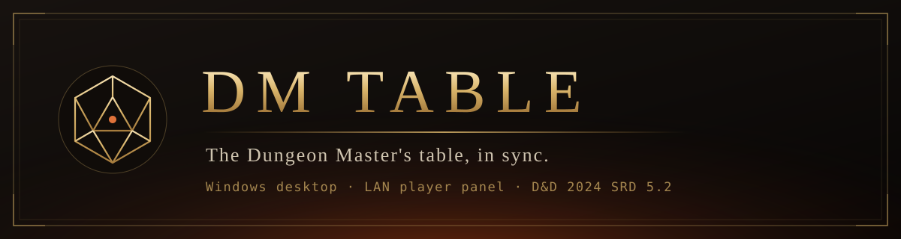
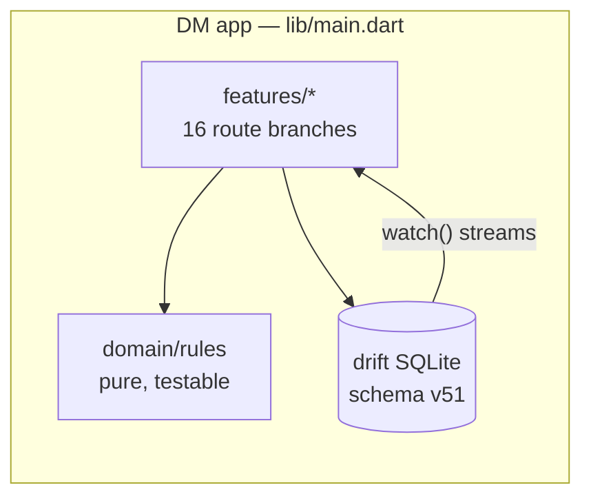

<div align="center">



<br>

**A single-seat Dungeon Master toolkit for D&D 2024 — campaign, combat, world and session management on the DM's screen. Fully offline.**

[](https://flutter.dev)
[](https://dart.dev)
[](#just-want-to-run-a-session-no-install-no-flutter-nothing-to-build)
[](#testing)
[](LICENSE)
[](NOTICE.md)
[](../../releases/latest)

</div>

---

## Just want to run a session? (no install, no Flutter, nothing to build)

1. Go to **[Releases](../../releases/latest)** and download the `DM-Table-*-windows.zip` under **Assets**.
2. Extract the zip anywhere (Desktop is fine).
3. Double-click **`dm_table.exe`** inside the extracted folder. That's the whole install.
4. Right-click `dm_table.exe` → **Send to → Desktop (create shortcut)** if you want an icon for next time.

No firewall prompt, no network setup, no accounts: the app never opens a socket.

Windows and Android are supported; there is currently no macOS/Linux/iOS build.

## What it is

DM Table is the **DM's own screen**, and only that. Everything lives in one local SQLite file per
campaign: the SRD library, your characters, the world graph, the calendar, your notes. Nothing is
uploaded, nothing is served, nothing needs a network.

Player characters live here too — the DM creates them with the guided wizard, keeps their sheets up
to date and reads them at the table. There is no player-facing client.

## Highlights

| | |
|---|---|
| **Campaigns** | Each campaign is its own SQLite file + media folder. Create, switch, delete, back up and restore — including *restore a backup as a new campaign* without touching the live one. |
| **SRD 5.2 library** | 505 creatures, 407 spells, 1 361 items & magic items, 60 classes/subclasses, backgrounds, species, feats and conditions — bundled offline, searchable, with full stat blocks. |
| **Characters** | Guided creation wizard, character sheet, level-up with subclass previews, homebrew features with usage counters, portraits, PDF export. |
| **Combat** | Initiative tracker, attack → damage flow, conditions with rules text, death saves, legendary actions & resistances, CR/XP encounter budget, monster portraits, turn timer. |
| **World** | Force-directed graph of locations, NPCs *and* factions with editable bond types, region maps with pins (treasure, shops, sub-maps), backlinks. |
| **Factions** | Guilds, cults, houses and gangs as first-class nodes: kind, goal, emblem, DM notes, and typed bonds (membership, enmity, trade) to anyone and anywhere. |
| **Clocks** | Blades-style segmented progress clocks for sieges, rituals and spreading rumours — standalone or attached to a quest or faction. |
| **Travel** | Map scale in miles, multi-stop routes drawn on the map, SRD pace rules, and **ongoing journeys** that survive tab switches, with random-encounter checks per travel segment. |
| **Calendar** | Fully custom calendar (months, weekday names, seasons, eras), chronicle timeline, recurring reminders, and calendar-driven shop restocking. |
| **Codex** | Notion-style nested DM notes: 15 block types, inline rich text, `[[wiki links]]`, slash commands (`/r`, `/monster`, `/spell`, `/page`…), drag & drop, search. |
| **Session** | Session log, in-memory roll log, clocks, party rest, downtime activities, dice macros, session recap and backups on one screen. |
| **Quests & loot** | Quests with owners and concrete rewards, loot sets that pour into shared party bags, shops with stock, price multipliers and restock periods. |
| **Random tables** | Editable d-anything tables with validation, a 39-culture offline name generator, starter tables in EN/TR. |
| **AI tools (opt-in)** | Bring your own key (Gemini / OpenAI / Claude) for NPC, quest, encounter and random-table generation. **Keys are stored on the device only.** |
| **Music** | Playlists and tracks copied into the campaign folder, included in backups. |
| **Export** | Codex tree → Markdown, campaign → JSON. Readable anywhere; a companion to the restorable `.zip` backup, not a replacement. |
| **Bilingual** | Every visible string exists in English and Turkish, checked by a test. |

## Screenshots

<!--
  Drop PNGs into docs/screenshots/ and reference them here, e.g.

  | Session | Combat | World |
  |---|---|---|
  |  |  |  |
-->

_Screenshots coming soon._

## Design

Two hand-built themes rather than stock Material: **Parchment** (warm cream, ink red, bronze) for
light mode and **Stone & Ember** (warm black, ember red, gold) for dark mode. Headings use
[Cinzel](https://fonts.google.com/specimen/Cinzel); long-form reading surfaces use
[EB Garamond](https://fonts.google.com/specimen/EB+Garamond), subset to Latin + Turkish
(851 KB → 186 KB). Body UI stays on the system sans for legibility. Colors, spacing and breakpoints
are exposed as theme extensions (`context.fantasyColors`, `context.spacing`, `Breakpoints`) instead
of scattered magic numbers.

## Building from source

Only needed if you want to modify the app — see [above](#just-want-to-run-a-session-no-install-no-flutter-nothing-to-build)
if you just want to play.

### Requirements

- [Flutter](https://docs.flutter.dev/get-started/install) 3.44 or newer (Dart 3.12+)
- Visual Studio 2022+ with the *Desktop development with C++* workload, and Developer Mode enabled

### Build

```bash
flutter pub get
flutter build windows --release          # Windows
flutter build apk --release --split-per-abi   # Android
```

The executable lands in `build/windows/x64/runner/Release/dm_table.exe`; the APKs land in
`build/app/outputs/flutter-apk/` (~42 MB for `arm64-v8a`).

`android/` builds and runs with the debug signing key so `flutter build apk` works out of the box —
a release you actually distribute needs
[your own keystore](https://docs.flutter.dev/deployment/android#signing-the-app).

Downloading music from a link needs `yt-dlp`, an external executable; that feature is
**desktop-only** and hides itself on Android. macOS/iOS/Linux runners are not in this repository.

## Running a session

Same steps whether you downloaded the release zip or built from source:

1. Open the app, pick or create a campaign — the SRD library is imported into it on first run.
2. Add the party's characters (**Characters → +**) or restore a backup.
3. Work from the **Session** tab: log, rolls, rests, downtime and macros are all there.

## Architecture



**Conventions worth knowing before contributing:**

- **Rules live in `domain/`.** Anything that can be a pure function is one, so it can be tested
  without a widget tree or a database.
- **Migrations.** A new column needs the table definition *and* an `addColumn` migration *and*
  `schemaVersion++`. Ordinary tests build a fresh database and would not catch a missing migration —
  `test/data/migration_test.dart` opens a real legacy schema on purpose.
- **Drift streams.** Raw `customStatement` writes do not notify watchers; use the typed API.
- **A migration step must be self-sufficient.** If it writes into a table another step creates, call
  `createTable` (which is `IF NOT EXISTS`) first — otherwise the chain breaks depending on which
  version the database started from.
- **Campaign switching replaces the whole `ProviderContainer`** rather than invalidating the database
  provider, so disposal runs leaf-to-root (see `lib/main.dart`).

More detail lives in [CONTRIBUTING.md](CONTRIBUTING.md).

## Project layout

```
lib/
  app/          theme, shell, router, design tokens, content gate
  data/         drift database, repositories, campaign registry, media stores
  domain/       pure rules: calendar, travel, encounters, random tables, point buy
  features/     one folder per surface (session, combat, world, codex, clocks, ai, …)
  l10n/         app_en.arb · app_tr.arb (key parity is a test)
assets/
  data/         SRD 5.2 content (gzipped JSON) + starter tables
  fonts/ logo/ rules/
tools/          fetch_open5e.dart · convert_5etools.dart · build_icon.dart (also Android icons)
  content_sources/  hand-maintained JSON merged into the bundles (never shipped)
test/           108 files, 1 174 tests
```

## Testing

```bash
flutter analyze
flutter test
```

The suite covers the rules engine, repositories, schema migrations and a set of widget regressions.
CI runs both on every push — see [.github/workflows/ci.yml](.github/workflows/ci.yml).

## Privacy

No telemetry, no accounts, no cloud, no network listener. The campaign database, media and backups
stay on the DM's machine. AI features are opt-in and use **your own** API key, stored in the device's
local preferences — it is never written to the database and never included in a backup.

## License

Code is licensed under the **GNU General Public License v3.0** — see [LICENSE](LICENSE).

Fonts are under the SIL Open Font License.

Game content in `assets/data/` is **mixed**: most of it comes from the **System Reference Document
5.2** under **CC BY 4.0**, but the bundles also contain 2024 core-rulebook and Monster Manual
material that is *not* openly licensed and *not* covered by this repository's GPL grant. **If you
fork or redistribute this project, strip those entries** — see [NOTICE.md](NOTICE.md) for what is
affected and how.

DM Table is an independent project, not affiliated with or endorsed by Wizards of the Coast.
