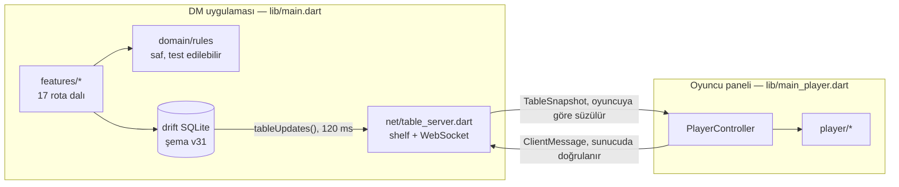

<div align="center">


<br>

**D&D 2024 için yerel ağ senkronizasyonlu bir Zindan Ustası masası — kampanya, savaş ve dünya yönetimi DM'in ekranında, canlı oyuncu paneli herkesin tarayıcısında.**

[](https://flutter.dev)
[](https://dart.dev)
[](#kurulum)
[](#test)
[](LICENSE)
[](NOTICE.md)

[English](README.md) · [Türkçe](README.tr.md)

</div>

---

## Nedir

DM Table **kendi cihazınızda çalışan** bir masa yardımcısıdır. DM, Windows masaüstü
uygulamasını açar; uygulama yerel ağda bir HTTP + WebSocket sunucusu başlatır ve oyuncu panelini
kendi varlıklarından servis eder. Oyuncular QR kodu okutup katılır — hesap yok, bulut yok, internet
bağlantısı gerekmez.

Oyuncuların gördüğü her şey **DM'in veritabanından türetilir ve anlık görüntü olarak yayınlanır.**
Tek yetkili DM'dir: oyuncular istek gönderir, sunucu doğrular, yazar ve yeni masa durumunu herkese
dağıtır.

```
DM uygulaması (Windows)                        Oyuncular (ağdaki herhangi bir tarayıcı)
┌──────────────────────────────┐               ┌────────────────────────────┐
│  Kampanya SQLite (drift)     │               │  Karakter kağıdı · zar     │
│  Kural motoru · SRD 5.2      │  görüntü →    │  Envanter · görev · harita │
│  Savaş · dünya · takvim      │  ← istek      │  Sohbet · mağaza · ganimet │
│  HTTP + WebSocket sunucusu ──┼──── LAN ──────┤  DM cihazından servis      │
└──────────────────────────────┘               └────────────────────────────┘
```

## Öne çıkanlar

| | |
|---|---|
| **Kampanyalar** | Her kampanya kendi SQLite dosyası + medya klasörü. Oluştur, geç, sil, yedekle ve geri yükle — *yedeği yeni kampanya olarak içe aktarma* dahil, açık kampanyaya dokunmadan. |
| **SRD 5.2 kütüphanesi** | 505 yaratık, 407 büyü, 1 361 eşya ve büyülü eşya, 60 sınıf/alt sınıf, geçmişler, türler, yetenekler ve durumlar — çevrimdışı gömülü, aranabilir, tam stat bloklarıyla. |
| **Karakterler** | Adım adım oluşturma sihirbazı, karakter kağıdı, alt sınıf önizlemeli seviye atlama, kullanım sayaçlı özel yetenekler, portreler. Oyuncular panelden kendi karakterini de kurabilir. |
| **Savaş** | Oyuncunun attığı inisiyatif, saldırı → hasar akışı, kural metinli durumlar, ölüm kurtarmaları, efsanevi eylem ve dirençler, CR/XP karşılaşma bütçesi, canavar portreleri. |
| **Dünya** | Yerleri *ve* NPC'leri tek grafikte toplayan kuvvet tabanlı düğüm haritası, düzenlenebilir bağ türleri, pinli haritalar (hazine, mağaza, alt harita), oyunculara açma/gizleme, geri bağlantılar. |
| **Seyahat** | Mil cinsinden harita ölçeği, harita üzerine çizilen çok duraklı rotalar, SRD tempo kuralları ve sekme değişimini atlatan **süren yolculuklar**, her dilimde rastgele karşılaşma kontrolü. |
| **Takvim** | Tamamen özelleştirilebilir takvim (aylar, gün adları, mevsimler, çağlar), tarihçe zaman çizelgesi, tekrarlayan hatırlatıcılar ve takvime bağlı mağaza stok yenilemesi. |
| **Kayıtlar** | Notion tarzı iç içe DM notları: 15 blok türü, satır içi zengin metin, `[[wiki bağlantıları]]`, eğik çizgi komutları (`/r`, `/monster`, `/spell`, `/page`…), sürükle-bırak, arama. |
| **Görevler & ganimet** | Görevi belirli oyunculara gösterme, tek tek kabul/ret ya da parti oylaması, envantere tam bir kez düşen ödül havuzları, parti keseleri, stoklu ve açık/kapalı mağazalar. |
| **Rastgele tablolar** | Doğrulamalı, istediğin zarla çalışan tablolar; 39 kültürlü çevrimdışı isim üreteci; TR/EN hazır tablolar. |
| **AI araçları (isteğe bağlı)** | Kendi anahtarınla (Gemini / OpenAI / Claude) NPC, görev, karşılaşma ve tablo üretimi. **Anahtar yalnızca cihazda saklanır, yerel ağa asla girmez.** |
| **Müzik** | Kampanya klasörüne kopyalanan çalma listeleri ve parçalar, yedeğe dahil. |
| **İki dil** | Görünen her metin — DM uygulaması, oyuncu paneli ve sunucu mesajları — İngilizce ve Türkçe. |

## Ekran görüntüleri

_Yakında._

## Tasarım

Hazır Material yerine elle kurulmuş iki tema: açık modda **Parşömen** (sıcak krem, mürekkep kırmızısı,
bronz), koyu modda **Taş & Kor** (sıcak siyah, kor kırmızısı, altın). Başlıklar
[Cinzel](https://fonts.google.com/specimen/Cinzel), uzun okuma yüzeyleri
[EB Garamond](https://fonts.google.com/specimen/EB+Garamond) — oyuncu paneli ağ üzerinden indirildiği
ve her megabayt önemli olduğu için Latin + Türkçe alt kümesine indirilmiş (851 KB → 186 KB). Gövde
arayüzü okunurluk için sistem sans fontunda kalır. Renkler, boşluklar ve kırılma noktaları dağınık
sabitler yerine tema uzantılarıyla verilir (`context.fantasyColors`, `context.spacing`, `Breakpoints`).

## Kurulum

### Gereksinimler

- [Flutter](https://docs.flutter.dev/get-started/install) 3.44 veya üstü (Dart 3.12+)
- Visual Studio 2022+ ve *C++ ile masaüstü geliştirme* iş yükü, Geliştirici Modu açık

### Derleme

```bash
git clone https://github.com/<kullanici>/dm-table.git
cd dm-table
flutter pub get
flutter build windows --release
```

Çalıştırılabilir dosya `build/windows/x64/runner/Release/dm_table.exe` altında oluşur.

DM uygulaması **yalnızca Windows** hedefler; depoda Android/iOS/macOS/Linux runner'ı yoktur.
Oyuncular hiçbir şey kurmaz — DM'in servis ettiği web panelini kullanır.

### Oyuncu paneli

Oyuncu paneli ayrı bir giriş noktasıdır (`lib/main_player.dart`); web'e derlenip **DM uygulamasının
içine** varlık paketi olarak gömülür (`assets/player_web/`, ~27 MB) ve DM cihazı bunu yerel ağda
servis eder. Hazır paket depoda olduğu için yeni klonlanan proje doğrudan derlenir. Paneli veya
protokolü değiştirdiğinde yeniden üret:

```bash
dart run tools/build_player_web.dart
```

> Araç ayrıca `pubspec.yaml` içindeki `player_web` varlık bloğunu yeniden yazar (Flutter varlık
> klasörlerini iç içe taramaz) ve kullanılmayan ~21 MB'lık renderer/eklenti yükünü budar.

### Oturum açmak

1. Uygulamayı aç, kampanya seç veya oluştur — SRD kütüphanesi ilk açılışta içine aktarılır.
2. **Oturum → masayı aç**; sunucu 8080 portunda (meşgulse ilk boş portta) başlar.
3. Oyuncular QR kodu okutur ya da `http://<dm-ip>:8080` adresini açıp karakterini sahiplenir.
4. Windows ilk başlatmada güvenlik duvarı izni sorar — **özel ağlar** işaretlenmezse kimse bağlanamaz.

## Mimari



**Katkı vermeden önce bilinmesi gerekenler:**

- **DM otoritesi.** İstemci mesajındaki hiçbir değere güvenilmez — karakter kimliği sunucunun
  sahiplenme haritasından gelir, kural değerleri veritabanından yeniden okunur.
- **Oyuncu başına süzme.** Her yayında tek bir temel anlık görüntü kurulur ve her sokete ayrı
  ölçeklenir (görevler, parti keseleri, fısıltılar). `TableSnapshot.copyWith`'e alan ekleyip iletim
  satırını unutmak sessiz bir hatadır — bunun için regresyon testi var.
- **Sunucu tarafı çeviri.** DM oyuncunun dilini bilemez; sunucu mesajları kod olarak taşınır
  (`encodeServerMsg`/`decodeServerMsg`) ve tarayıcıda çevrilir.
- **Migration.** Yeni sütun = tablo tanımı **+** `addColumn` migration'ı **+** `schemaVersion++`.
  Normal testler temiz veritabanı kurduğu için eksik migration'ı yakalamaz; bu yüzden
  `test/data/migration_test.dart` bilerek eski şemayı ham SQL ile kurar.
- **Drift akışları.** Ham `customStatement` yazımları izleyicileri tetiklemez; tipli API kullan.

Ayrıntılar: [CONTRIBUTING.md](CONTRIBUTING.md).

## Proje düzeni

```
lib/
  app/          tema, kabuk, router, tasarım jetonları, içerik kapısı
  data/         drift veritabanı, depolar, kampanya kaydı, medya store'ları
  domain/       saf kurallar: takvim, seyahat, karşılaşma, rastgele tablo, puan alımı
  features/     her yüzey için bir klasör (session, combat, world, codex, ai, …)
  net/          protokol, masa sunucusu, oturum servisi
  player/       oyuncu web paneli
  l10n/         app_en.arb · app_tr.arb
assets/
  data/         SRD 5.2 içeriği (gzip JSON) + hazır tablolar
  player_web/   derlenmiş oyuncu paneli, ağ üzerinden servis edilir
  fonts/ logo/ rules/
tools/          build_player_web.dart · fetch_open5e.dart · build_icon.dart
  content_sources/  paketlere karışan elle bakılan JSON (uygulamaya girmez)
test/           102 dosya, 925 test
```

## Test

```bash
flutter analyze
flutter test
```

Testler kural motorunu, depoları, şema migration'larını, protokolü ve bir dizi widget regresyonunu
kapsar. CI her push'ta ikisini de çalıştırır — [.github/workflows/ci.yml](.github/workflows/ci.yml).

## Gizlilik

Telemetri yok, hesap yok, bulut yok. Kampanya veritabanı, medya ve yedekler DM'in makinesinde kalır;
yerel ağ sunucusu yalnızca aynı ağdaki cihazlarla konuşur. AI özellikleri isteğe bağlıdır ve **senin**
API anahtarını kullanır; anahtar cihazın yerel tercihlerinde saklanır, veritabanına yazılmaz, yedeğe
girmez ve ağ üzerinden gönderilmez.

## Lisans

Kod **GNU General Public License v3.0** ile lisanslanmıştır — bkz. [LICENSE](LICENSE).

Fontlar SIL Open Font License altındadır.

`assets/data/` içindeki oyun içeriği **karışıktır**: büyük bölümü **CC BY 4.0** ile lisanslanan
**System Reference Document 5.2**'den gelir, ancak paketlerde açık lisanslı OLMAYAN ve bu deponun GPL
kapsamına GİRMEYEN 2024 temel kitap + Monster Manual içeriği de vardır. **Projeyi fork'lar veya
dağıtırsan bu kayıtları temizle** — neyin etkilendiği ve nasıl yapılacağı [NOTICE.md](NOTICE.md)
dosyasında.

DM Table bağımsız bir projedir; Wizards of the Coast ile bağlantılı değildir ve onun onayını taşımaz.
